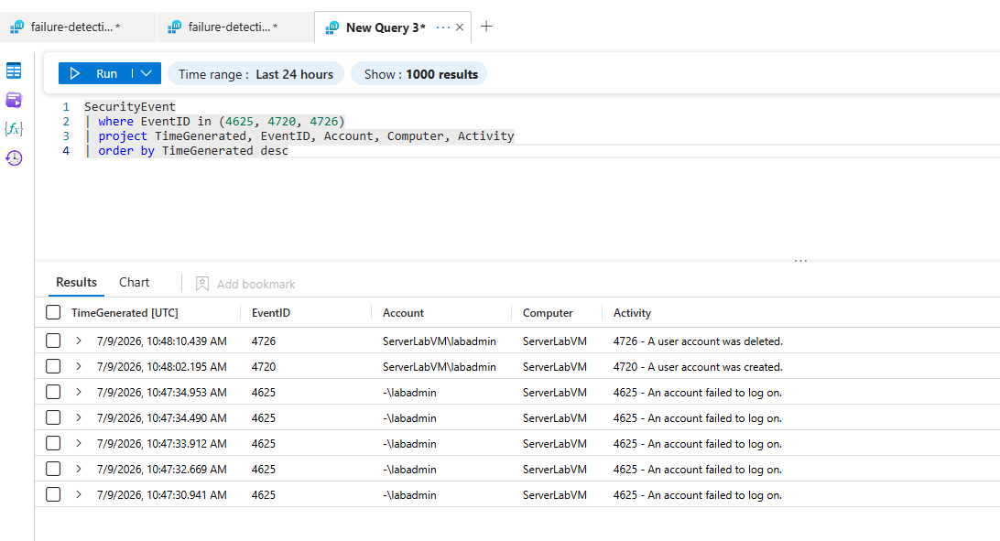

# Detection: Suspicious Local Account Creation

## Description
Detects creation of new local user accounts on Windows systems.
May indicate attacker establishing persistence after initial access.

## KQL Query
See `/kql-queries/account-creation-4720.kql`

```kql
SecurityEvent
| where EventID == 4720
| project TimeGenerated, Account, TargetAccount, Computer, Activity
| order by TimeGenerated desc
```

## MITRE ATT&CK
| Field | Value |
|-------|-------|
| Tactic | Persistence |
| Technique | T1136.001 Create Account: Local Account |
| Severity | High |

## Analytics Rule
- **Name:** `Suspicious Local Account Creation`
- **Run every:** 5 hours
- **Lookback:** 5 hours
- **Threshold:** > 0 results

## False Positive Analysis
Authorized administrators creating service or test accounts may trigger 
this rule. Verify account name and creator identity before escalating.

## Evidence
