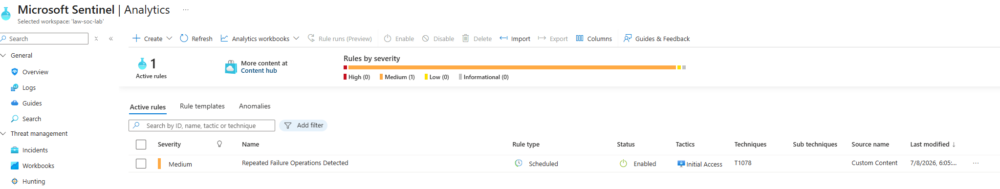

# Detection: Brute Force - Multiple Failed Logons

## Description
Detects multiple failed logon attempts from the same account within 
a 1-hour window. May indicate brute force or password spray attack.

## KQL Query
See `/kql-queries/brute-force-4625.kql`

```kql
SecurityEvent
| where EventID == 4625
| summarize FailedLogons = count() by Account, Computer, IpAddress, bin(TimeGenerated, 1h)
| where FailedLogons >= 3
| order by FailedLogons desc
```

## MITRE ATT&CK
| Field | Value |
|-------|-------|
| Tactic | Credential Access |
| Technique | T1110 Brute Force |
| Severity | High |

## Analytics Rule
- **Name:** `Brute Force - Multiple Failed Logons`
- **Run every:** 5 hours
- **Lookback:** 5 hours
- **Threshold:** >= 3 failed logons per hour

## False Positive Analysis
Authorized users mistyping passwords may trigger this rule.
Verify account identity and check for successful logon after failures.

## Evidence
